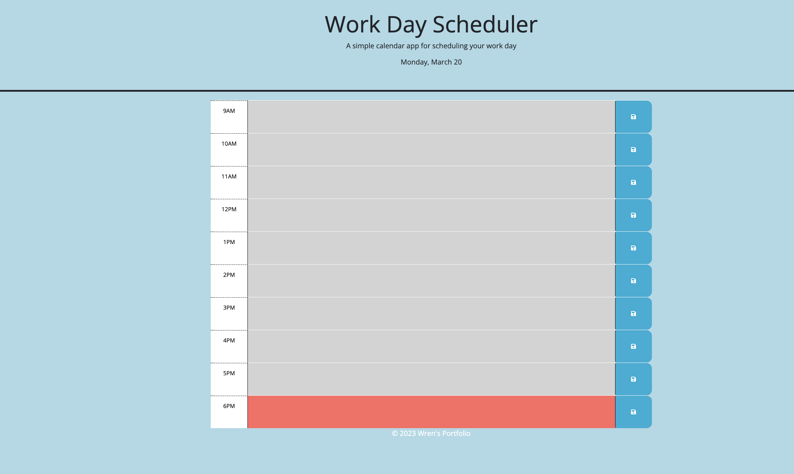

# DailyPlanFromWren

This is a simple daily planner web application designed to help employees with busy schedules effectively manage their time by adding important events to their daily schedule. The application is deployed at the following link: [ChallengeDailyPlanFromWren](https://nhunguyen-debug.github.io/Module5-ChallengeDailyPlanFromWren/).

## User Story

```md
AS AN employee with a busy schedule
I WANT to add important events to a daily planner
SO THAT I can manage my time effectively
```

## Acceptance Criteria

```md
GIVEN I am using a daily planner to create a schedule
WHEN I open the planner
THEN the current day is displayed at the top of the calendar
WHEN I scroll down
THEN I am presented with timeblocks for standard business hours
WHEN I view the timeblocks for that day
THEN each timeblock is color coded to indicate whether it is in the past, present, or future
WHEN I click into a timeblock
THEN I can enter an event
WHEN I click the save button for that timeblock
THEN the text for that event is saved in local storage
WHEN I refresh the page
THEN the saved events persist
```

## How to Use

1. Visit the deployed web application at [ChallengeDailyPlanFromWren](https://nhunguyen-debug.github.io/Module5-ChallengeDailyPlanFromWren/).

2. The current day will be displayed at the top of the calendar.

3. Scroll down to view timeblocks for standard business hours.

4. Each timeblock is color-coded to indicate whether it is in the past, present, or future.

5. Click into a timeblock to enter an event.

6. After entering your event, click the save button for that timeblock.

7. Your event text will be saved in local storage.

8. Even if you refresh the page, the saved events will persist.

## Screenshots



## Credits

This project was created by [Nhu Nguyen](https://github.com/nhunguyen-debug) as a part of a coding challenge. The project is open source and contributions are welcome.

---

Feel free to explore the web application and provide any feedback or contributions to enhance its functionality. If you have any questions or need assistance, please don't hesitate to reach out to [Nhu Nguyen](https://github.com/nhunguyen-debug). Thank you for using ChallengeDailyPlanFromWren!
